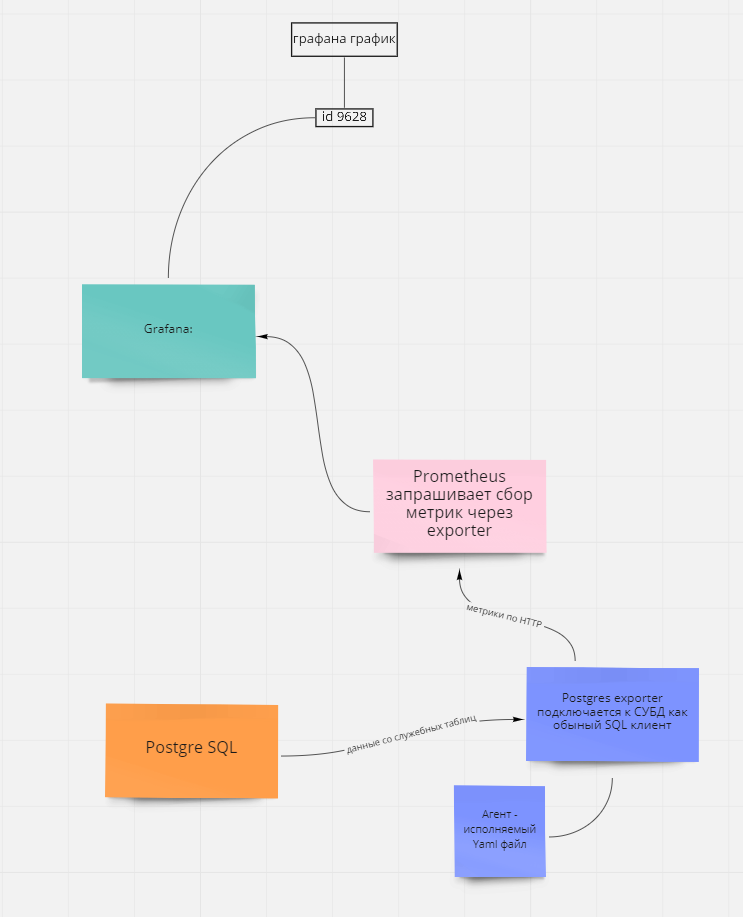

#1 Собрать контейнеры из compose файлов

> `docker-compose -f prom_grafana.yaml up`
> `docker-compose -f postgres_exp.yaml up`

#2 Импорт демо базы данных в POSTGRES

> `docker exec -i [container_postgre_id] psql -U ruslan -d demo < demo.sql`

http://192.168.19.128 - ип адрес хоста Linux Ubuntu

#3 Grafana -> Data Source указать http://192.168.19.128:9090 - Порт Prometheus
#-> import dashboard grafana id 9628

#4 Образец выполнения селект запроса с бд

> `docker exec -i 01ea55ff0236 psql -U ruslan -d demo -c 'SELECT * FROM "flights_v" WHERE "flight_id" > '0' AND "departure_city" IS NOT NULL'`
